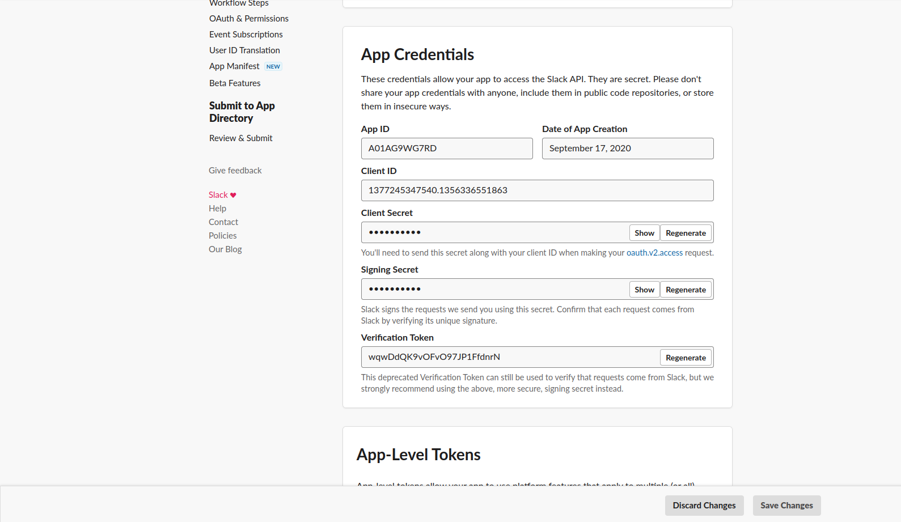
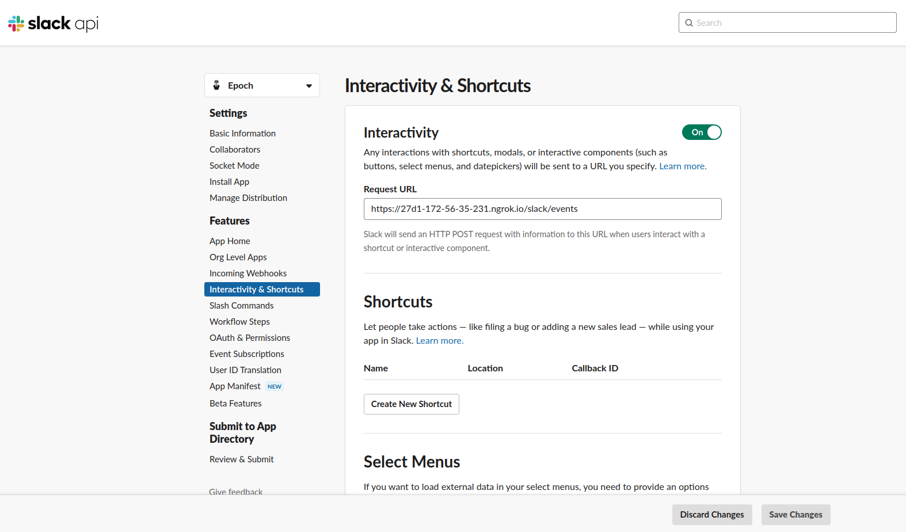
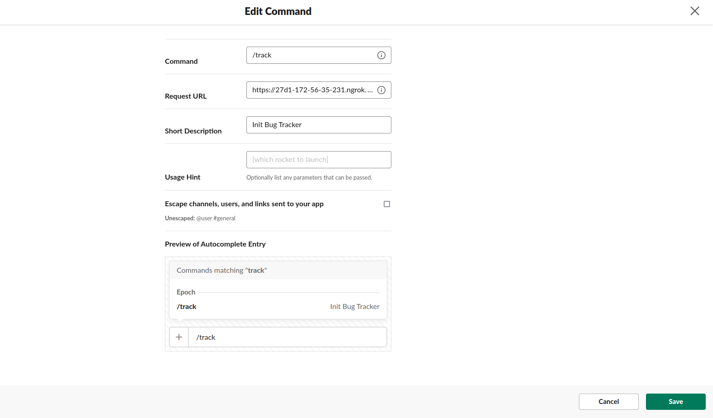
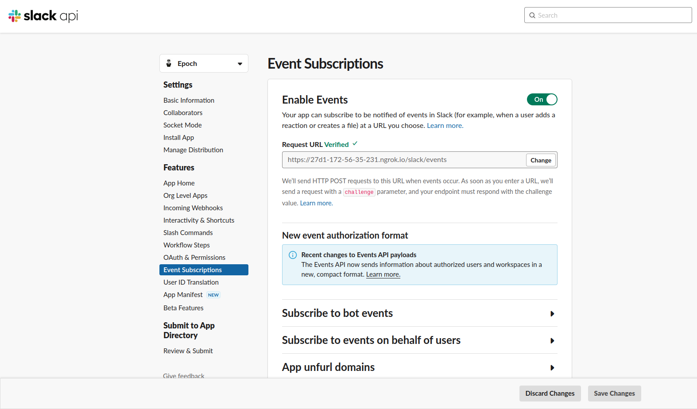

***

# Introduction
This project is a Node.js application that automates Slack using the Bolt framework. The application allows users to personalize Slack by using commands in Slack chat to perform tasks such as bug tracking, scheduling, and content storage.

## Getting Started
We need to first configure your slack api. Visit https://api.slack.com/, login and then create a new app. Navigate to manage apps and then to your newly created app. 


Here at the default page, grab the signing secret. (SIGNING_SECRET)

Navigate to OAUTH & Permissions and grab the Bot User OAuth Token. (BOT_ACCESS_TOKEN)

Visit [upstash](https://upstash.com/) and start a free redis instance, grab the main url. (REDIS_URL)

Lastly choose a cloud database that supports postgres instances, and grab the main url. I chose [supabase](https://supabase.com/). (PSQL_URL)

Configure this project by setting the following environment variables:

    BOT_ACCESS_TOKEN= The Slack bot token
    SIGNING_SECRET= Slack signature
    PORT= Main application port
    REDIS_URL= Redis cloud url
    PSQL_URL= Postgres Host Url

Once the environment variables are set, you will need to have Node.js and npm installed on your machine. You can install the dependencies and start the application by running the following commands:
```
npm install
npm run start
```

## Expose Your Bot
Make sure to have [ngrok](https://ngrok.com/) for this step. Run ngrok http 3000 and copy the "Forwarding" url, ex: https://7d0b-173-52-201-90.ngrok.io

Go back to you slack api page and navigate to 'Interactivity & Shortcuts' on the side menu:

In the request url input field, paste your link with /slack/events added to the end of it, ex: https://7d0b-173-52-201-90.ngrok.io/slack/events. Click save.

Next, navigate to 'Slash Commands' and create a new command.

Here put the same link we used for interactivity in the request url field. Give the command a name and description. Click save.

Finally, with the same link, navigate to 'Event Subscriptions':

Paste the link in the request url field. Save changes.

## Troubleshooting
At the point of running this app, permission errors and missing scope errors will prompt. In your slack api website where we got our bot token at 'OAuth & Permissions' navigate down to the 'Scopes' section of the page and add all missing scopes there. Save changes.

## Usage
The application can be used in Slack by sending commands in the chat. The following commands are supported:
- `/track help`: List all commands for bug tracking.
- `/track create sprint`: Start a new sprint to track a bug.
- `/track open sprint <SPRINT NAME>`: Open one sprint.
- `/track open sprints`: Open list of all sprints.

# References
- Node.js (https://nodejs.org/)
- npm (https://www.npmjs.com/)
- Slack API (https://api.slack.com/)
- Bolt framework (https://slack.dev/bolt/)
- Ngrok (https://ngrok.com/)


:octocat:

<!-- https://dvj70ijwahy8c.cloudfront.net/Epoch/icon | [{"description": "Using this bot application is through the use of commands, /help being the example.", "image": "https://dvj70ijwahy8c.cloudfront.net/Epoch/slides/image_7"}, {"description": "This is the main directory for a list of all features to use through commands. For the time being these features are for bug tracking.", "image": "https://dvj70ijwahy8c.cloudfront.net/Epoch/slides/image_6"}, {"description": "Upon selecting 'create sprint', a form is prompted to set the descriptions of the sprint and expected time of completion.", "image": "https://dvj70ijwahy8c.cloudfront.net/Epoch/slides/image_5"}, {"description": "On submission, you are redirected to the main sprint directory that depicts status details of all sprints plus the newest one created. For each one you are also able to open sprints that direct you to it's profile card depicting expanded status details, ticket management, and providing CRUD features.", "image": "https://dvj70ijwahy8c.cloudfront.net/Epoch/slides/image_4"}, {"description": "Upon creating tickets, a form is prompted to enter descriptive details and slack members you would want to have this ticket assigned to.", "image": "https://dvj70ijwahy8c.cloudfront.net/Epoch/slides/image_3"}, {"description": "When submitted, the assigned slack member is requested to be the worker of the ticket, and receives an invite that would require a date assignment from the worker before approving assignment.", "image": "https://dvj70ijwahy8c.cloudfront.net/Epoch/slides/image_2"}, {"description": "Here is the 'receipt' page that has all accepted and rejected or pending ticket requests.", "image": "https://dvj70ijwahy8c.cloudfront.net/Epoch/slides/image_1"}, {"description": "And a final over view of a set sprint with a ticket assigned to a worker.", "image": "https://dvj70ijwahy8c.cloudfront.net/Epoch/slides/image_0"}] -->


